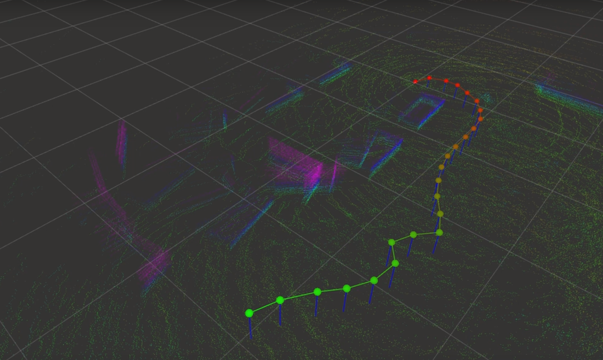

# hdl_graph_slam

***Disclaimer:*** The original work can be found at https://github.com/koide3/hdl_graph_slam and we take no credit for the author's work.

Kenji Koide, Active Intelligent Systems Laboratory, Toyohashi University of Technology <a href="http://www.aisl.cs.tut.ac.jp">[URL]</a> <br>
koide@aisl.cs.tut.ac.jp

hdl_graph_slam is an open source ROS package for real-time 3D slam using a 3D LIDAR. It is based on 3D Graph SLAM with NDT scan matching-based odometry estimation and loop detection. It also utilizes floor plane detection to generate an environmental map with a completely flat floor. We have tested this packaged mainly in indoor environments, but it can be applied to outdoor environment mapping as well.

## Results
***Husky Dataset***

<a href="https://drive.google.com/file/d/1Snvz9VU2-CtfGEVY1_JzVO7b-XaeRaFL/view?usp=sharing">video link</a>


***Quad Dataset***

<a href="https://drive.google.com/file/d/1dji3F1K1WyiPXrWMNWNLNFjQwYLJgAue/view?usp=sharing">video link</a>



## Requirements
*Note that this package should be installed in ROS indigo in Ubuntu 14.04*

***hdl_graph_slam*** requires the following libraries:
- OpenMP
- PCL 1.7
- g2o

Note that ***hdl_graph_slam*** cannot be built with older g2o libraries (such as ros-indigo-libg2o). ~~Install the latest g2o:~~
The latest g2o causes segfault. Use commit *a48ff8c42136f18fbe215b02bfeca48fa0c67507* instead of the latest one:

```bash
git clone https://github.com/RainerKuemmerle/g2o.git
cd g2o
git checkout a48ff8c42136f18fbe215b02bfeca48fa0c67507
mkdir build && cd build
cmake .. -DCMAKE_BUILD_TYPE=RELEASE
make -j8
sudo make install
```

The following ROS packages are required:
- geodesy
- nmea-msgs
- pcl-ros
- <a href="https://github.com/koide3/ndt_omp">ndt_omp</a>
```bash
sudo apt-get install ros-indigo-geodesy ros-indigo-pcl-ros ros-indigo-nmea-msgs

cd catkin_ws/src
git clone https://github.com/koide3/ndt_omp.git
```

**[optional]** *bag_player.py* script requires ProgressBar2.
```bash
sudo pip install ProgressBar2
```

## Husky Dataset Instructions
Download [husky.bag](https://drive.google.com/file/d/1QqVY7z-3ojrfrI3Q6LTY4Ui_0nkOpEqO/view?usp=sharing) into catkin_ws/bags/

```bash
roslaunch hdl_graph_slam husky.launch
rosrun hdl_graph_slam bag_player.py bags/husky.bag
```

## Quad Dataset Instructions
Download [nardos3.bag](https://drive.google.com/file/d/1jjilcRgPEUWECLCSd0r0EZuduAeX_RGM/view?usp=sharing) into catkin_ws/bags/

```bash
roslaunch hdl_graph_slam nardos.launch
```
